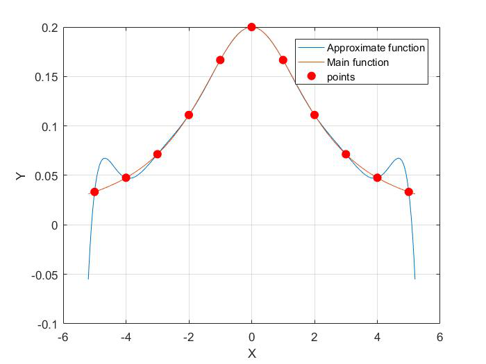
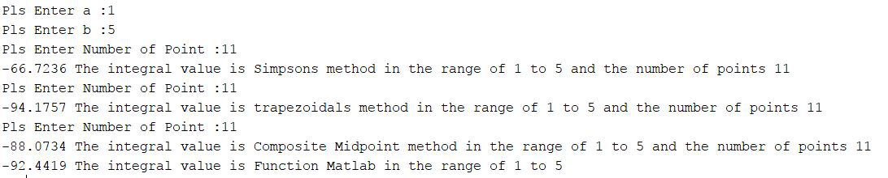
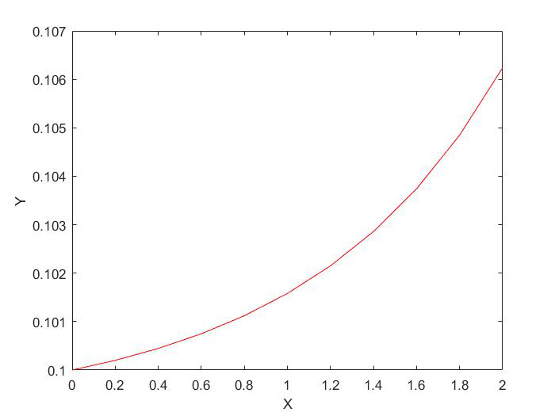

# Numerical-Analysis

## Function approximation 
With the interpolation method, the approximated function for the data is as follows: 

## Integration
Using Simpsons, trapezoidals, and composite midpoint methods, we obtained the integral value of the mentioned function. You can see the result values in the figure below. 

**Note1:** As we know, the number of points in the mentioned methods has limitations (including the number of points that must be odd and more than 3) If the user enters this number of points incorrectly with the designed error "Enter the number of points incorrectly" You've encountered.
**Note2:** The integral error of the Simpsons method was not as good as other methods.

## Differential equation
The Euler method is a numerical method for solving first-order differential equations. For example, suppose we have a first-order differential equation as follows: 
  

The first step is to rewrite the above equation as follows, where x is a function of y. 

So the equation is written like this:

We now use the Euler method, which is a recursive relation: 

Where h is the step size. The difference between x_{n} and x_{n+1}: 

You can see the result values in the figure below.

